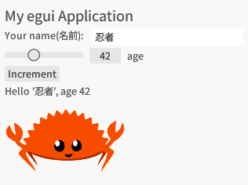

Rust 製の GUI ライブラリである [egui](https://github.com/emilk/egui) のサンプルである [hello_world](https://github.com/emilk/egui/tree/master/examples/hello_world) を動かしてみたメモ。

[2021年末に基本的な使い方を記事にまとめていた](https://zenn.dev/tris/articles/rust-egui-01)が、2024年9月次点ではバージョンが当時の `0.15` から `0.28` に上がっていてかなり変化があるため、改めて試してみた。

サンプルのアプリケーションを動かし、日本語の入力・表示までを実装した。




## 依存関係

`cargo` コマンドでプロジェクトを作成後、依存を追加する。

```sh
cargo add eframe
```

画像を表示するために、`egui_extras`([リポジトリ](https://github.com/emilk/egui/tree/master/crates/egui_extras)) を追加する。このとき、`--features="image"` により画像表示を有効化する。

```sh
cargo add egui_extras --features="image"
```

## 画像の準備

[画像ファイル](https://github.com/emilk/egui/blob/master/crates/egui/assets/ferris.png)をダウンロードする。

`assets` フォルダを作成し、その中に画像ファイルを配置する。


## コーディング

`src/main.rs` を記述する。

[元のソース](https://github.com/emilk/egui/blob/master/examples/hello_world/src/main.rs)をコピペしてきたものから、一部以下のような修正を加えている。

- コメントの翻訳・追加。
- ログ出力部分をコメントアウト。
- 画像ファイルのパスをローカル実行環境に合わせて変更。`main.rs` から見た相対パスを記述。


## 実行

```sh
cargo run
```

これにより、ローカルでネイティブアプリとして実行される。


## (オプション) 日本語の対応

フォントのファイルを、プロジェクト内に配置する。例えば [Google から Noto Sans JP をダウンロードしてくる](https://fonts.google.com/noto/specimen/Noto+Sans+JP)など。

フォントを読み込んでセットするために `MyApp` に `new()` を定義して、処理を書く。記載内容は `src/main.rs` のコードを参照。

`main()` の `eframe::run_native` で、直接 `MyApp::default` を返すのではなく、`MyApp::new()` を使用する。

なおフォントの設定についての[公式ドキュメントはここ](https://docs.rs/egui/latest/egui/struct.FontDefinitions.html)で、[サンプルもある](https://github.com/emilk/egui/blob/master/examples/custom_font/src/main.rs)。
